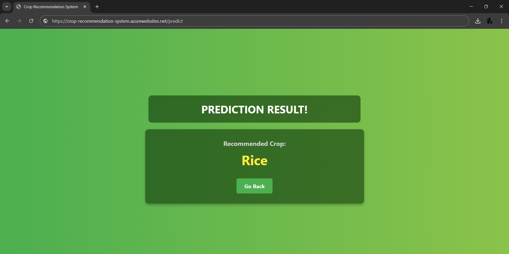

# Crop Recommendation System

## Overview

The **Crop Recommendation System** is a Flask-based web application designed to help farmers and agricultural enthusiasts to identify the most suitable crops for cultivation based on specific environmental parameters. By taking inputs such as nitrogen content, phosphorus content, potassium content, temperature, humidity, soil pH, and rainfall, the system predicts the optimal crop to be grown.

## Tech Stack Used:
- Flask
- Scikit Learn
- Azure App Service
- Python

## Deploying the Flask Application Using Azure App Service

First, I opened the Flask project in VS Code and installed the Azure App Service extension. Then, I signed in to my Azure account, created a new App Service, and deployed the Flask app directly from VS Code, making it accessible via a public URL.

## Home Page

The home page of the Crop Recommendation System allows users to input various environmental parameters like nitrogen content, phosphorus content, potassium content, temperature, humidity, soil pH, and rainfall to get a crop recommendation.

## Result Page

After submitting the inputs, the result page displays the recommended crop based on the provided environmental parameters.

